<h1 align="center">
    
     
</h1>

## :rocket: Universidade Serafine:

Esse é o repositório do projeto da Universidade Serafine, uma aplicação de uso interno da empresa Serafine Clothing.

Esse projeto vem com o objetivo de ajudar os franqueados da empresa a saber como melhor gerir sua loja, aplicar técnicas de vendas, técnicas de contratação de novos funcionários, dentre outros. 

Tudo isso é feito através de documentos que são cadastrados na área do administrador. Nesses documentos é possível linkar para o Google Drive onde se encontra todos os documentos. Também é possível colocar um link de um vídeo do YouTube que um player é exibido em tela para o franqueado.

## :hammer: Para criação dessa aplicação foi utilizado:
- [ReactJS](https://pt-br.reactjs.org/docs/getting-started.html), para desenvolvimento Front-end.
- [Node.js](https://nodejs.org/en/), para desenvolvimento Back-end.

### ADMIN - Login
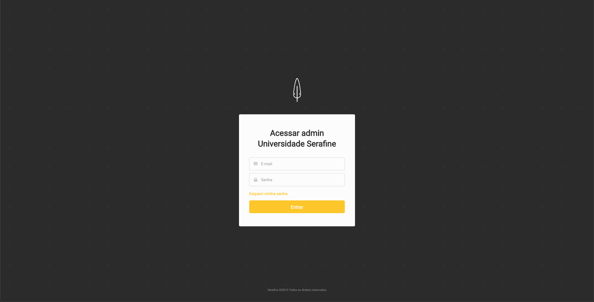

### ADMIN - Esqueci minha senha
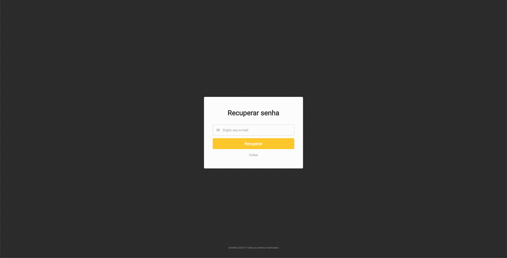

### ADMIN - Categorias
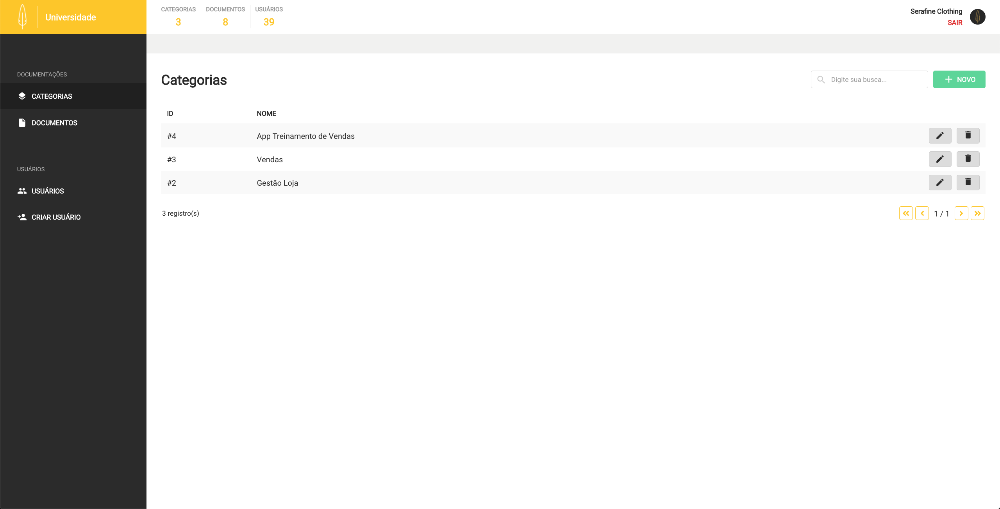

### ADMIN - Form Categorias

### ADMIN - Documentos
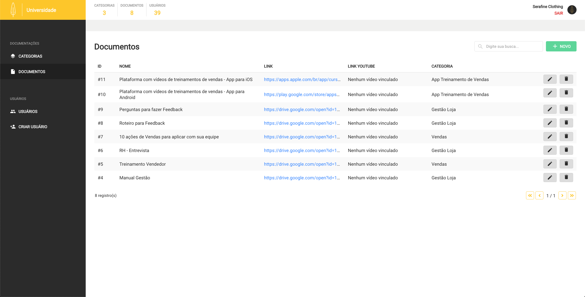

### ADMIN - Form Documentos
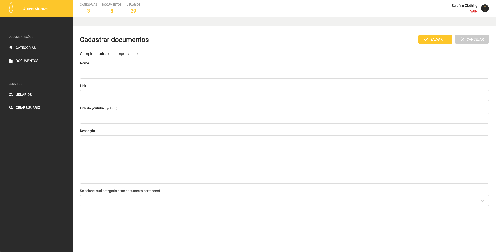

### ADMIN - Usuários
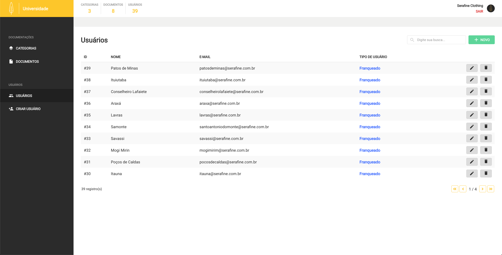

### ADMIN - Form Usuários
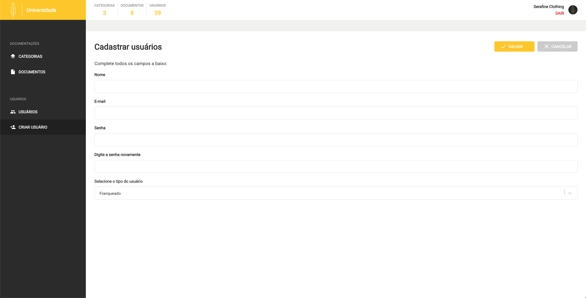

### ADMIN - 404
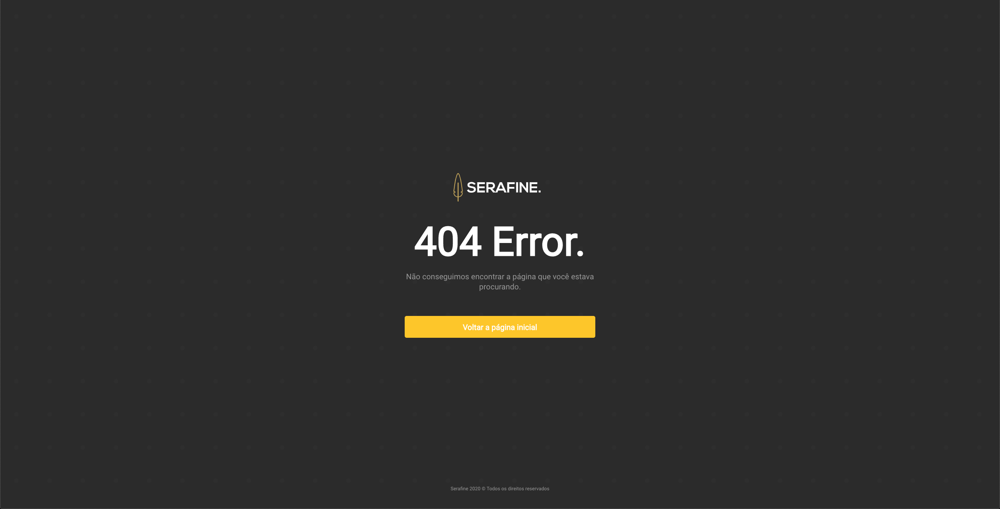

### Franqueado - Login
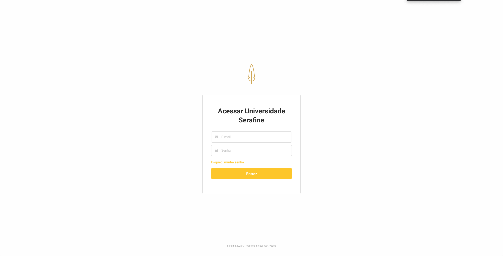

### Franqueado - Documentações
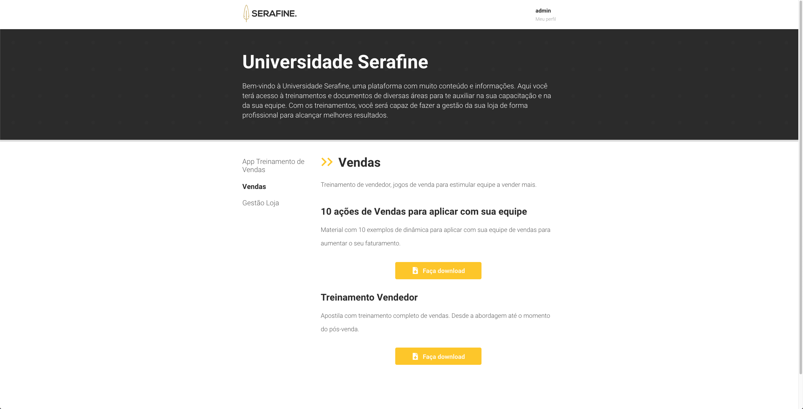

### Franqueado - Documentações2
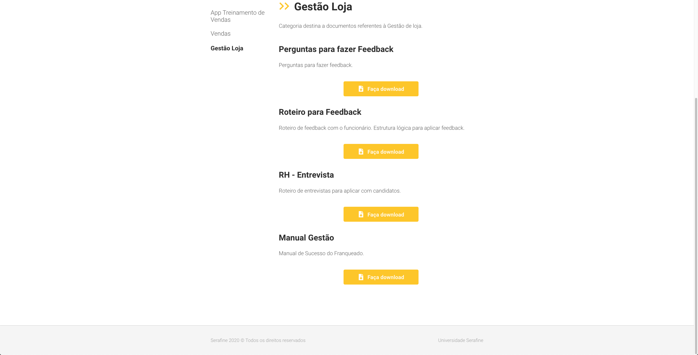
